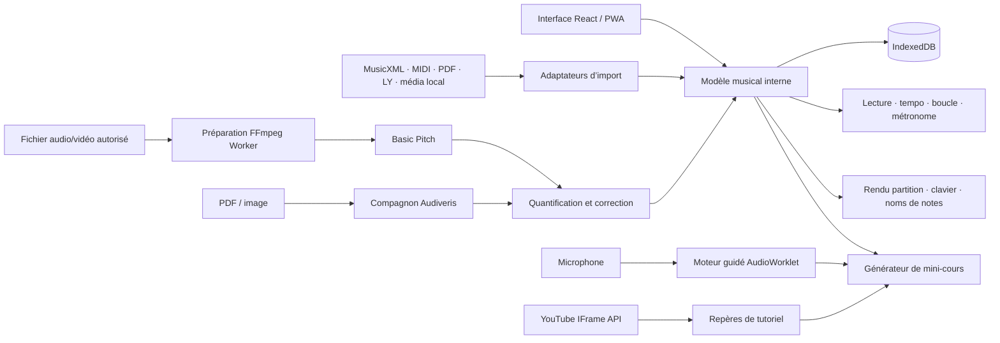

# Spécification d’architecture — Atelier Piano

Ce document est la référence autonome pour reprendre, maintenir ou reconstruire Atelier Piano dans un autre IDE. Il décrit l’état actuel, la cible fonctionnelle, les formats, les contrats de données, les moteurs audio, les limites de la transcription et les critères permettant de vérifier que l’application est correcte.

## 1. Objectif et périmètre

### 1.1 Objectif produit

Atelier Piano est une application web progressive (PWA) personnelle, installable depuis Safari ou Chrome, destinée à transformer une partition ou un enregistrement autorisé en séance de piano guidée.

La boucle principale est :

1. importer une œuvre ;
2. afficher ou convertir sa partition ;
3. créer de petits exercices par passage et par main ;
4. écouter une référence, ralentir et boucler ;
5. écouter le piano de l’utilisateur au microphone ;
6. signaler les notes et rythmes à retravailler ;
7. enregistrer la progression localement.

### 1.2 Public cible

- un seul utilisateur dans la première version ;
- pianiste débutant ou intermédiaire ;
- usage prioritaire sur iPad posé sur le pupitre ;
- usage secondaire sur iPhone et ordinateur ;
- aucune compétence technique requise pour utiliser l’application.

### 1.3 Principes de produit

- application indépendante, sans WordPress ;
- pas d’App Store obligatoire ;
- priorité à Safari iOS/iPadOS et aux navigateurs modernes ;
- pas de compte, de publicité ni de paiement dans la première version ;
- traitement local par défaut ;
- fonctionnement hors ligne pour la bibliothèque, la partition et les exercices déjà chargés ;
- MusicXML comme format pivot de notation ;
- résultat de transcription présenté comme un brouillon à vérifier, jamais comme une vérité garantie.

### 1.4 État actuellement implémenté

La version `1.0.0` contient :

- une application React, TypeScript et Vite ;
- une PWA avec manifeste et service worker ;
- l’import MusicXML, XML, MXL, MIDI, PDF et LilyPond ;
- la transcription locale de fichiers audio et de vidéos compatibles par Basic Pitch ;
- le rendu MusicXML avec OpenSheetMusicDisplay ;
- l’aperçu PDF ;
- la lecture synthétisée d’une partition ;
- un métronome, un réglage du tempo et une boucle ;
- la génération d’étapes écoute, main droite, main gauche, mains ensemble et interprétation ;
- un clavier tactile ;
- le calibrage automatique du microphone et la reconnaissance monophonique en direct ;
- la préparation des accords attendus dans les exercices ;
- les compteurs de notes correctes, d’erreurs et de séries ;
- la sauvegarde locale dans IndexedDB ;
- l’export MusicXML, MIDI et ABC ;
- l’affichage des notes en notation française ou internationale ;
- l’ajout de tutoriels YouTube officiels avec passages horodatés ;
- la sauvegarde et la restauration complète de la bibliothèque au format JSON.

### 1.5 Périmètre cible

Les évolutions avancées restant proposées sont :

- un flux PDF vers MusicXML avec Audiveris ;
- le support assisté de sources LilyPond `.ly` via un compagnon local ;
- la reconnaissance polyphonique fiable au microphone sur un piano acoustique ;
- un éditeur graphique complet pour corriger les brouillons de transcription ;
- une file intelligente de passages faibles à retravailler.

### 1.6 Hors périmètre initial

- catalogue commercial de morceaux ;
- achat ou redistribution de partitions protégées ;
- réseau social ;
- reconnaissance parfaite de toute musique polyphonique ;
- extraction automatique de l’audio d’une URL YouTube ;
- analyse fiable du doigté depuis n’importe quelle vidéo ;
- synchronisation multi-appareils tant qu’aucun compte n’est souhaité ;
- connexion MIDI matérielle garantie sur Safari iPhone/iPad.

## 2. Définitions

| Terme | Définition dans ce projet |
| --- | --- |
| PWA | Site installable sur l’écran d’accueil, avec cache hors ligne et apparence d’application. |
| MusicXML | Format pivot contenant notes, durées, mesures, portées, voix et indications musicales. Extensions `.musicxml`, `.xml` et `.mxl`. |
| MIDI | Suite d’événements de jeu. Très précise pour les hauteurs et le temps, mais sans graphie complète ni orthographe enharmonique fiable. |
| LilyPond | Langage texte de gravure musicale, extension `.ly`. C’est une source structurée, mais pas un format actuellement analysé par le navigateur. |
| ABC | Notation musicale textuelle utilisant principalement les lettres `A` à `G`, avec une syntaxe pour rythmes, octaves, altérations et voix. |
| Noms anglo-saxons | `C D E F G A B`, soit `Do Ré Mi Fa Sol La Si`. |
| AMT | Automatic Music Transcription : transformation d’un signal audio en événements musicaux. |
| OMR | Optical Music Recognition : transformation d’une image de partition en notation symbolique. |
| Détection guidée | Analyse limitée aux notes attendues par la partition. Plus simple et plus fiable qu’une transcription libre. |
| Transcription libre | Tentative de retrouver toutes les notes d’un audio sans partition de référence. |
| AudioWorklet | Traitement audio Web exécuté hors du fil principal de l’interface, adapté à la faible latence. |
| Brouillon de partition | Résultat automatiquement quantifié qui doit pouvoir être écouté, corrigé et validé. |
| Compagnon local | Petit programme facultatif sur Mac/PC pour exécuter Audiveris, LilyPond ou music21 sans envoyer les fichiers sur Internet. |
| Passage | Intervalle de mesures utilisé comme unité de cours, de boucle et de statistique. |

## 3. Exigences, contraintes et directives

Les identifiants sont stables et doivent être cités dans les tickets, tests et demandes adressées à une IA de développement.

### 3.1 Exigences fonctionnelles

#### Import et bibliothèque

- **REQ-IMP-001 — MusicXML.** L’application doit importer `.musicxml`, `.xml` et `.mxl`, conserver la source et produire le modèle interne de notes.
- **REQ-IMP-002 — MIDI.** L’application doit importer `.mid` et `.midi`, conserver le binaire et répartir les notes entre les mains à partir des pistes, du nom des pistes et, en dernier recours, de la hauteur.
- **REQ-IMP-003 — PDF.** L’application doit afficher le PDF immédiatement et indiquer clairement si aucune donnée musicale structurée n’est disponible.
- **REQ-IMP-004 — Audio/vidéo possédé.** Une version ultérieure doit accepter au minimum WAV, MP3, M4A et une sélection de formats vidéo locaux, sous réserve que l’utilisateur confirme disposer des droits nécessaires.
- **REQ-IMP-005 — LilyPond.** Un fichier `.ly` doit être reconnu comme source structurée. La première implémentation peut demander le compagnon local pour produire MIDI/PDF ; une analyse complète de la grammaire LilyPond dans le navigateur n’est pas requise.
- **REQ-IMP-006 — Limites d’entrée.** Chaque import doit vérifier extension, type MIME, taille, validité et erreurs de décodage avant stockage.
- **REQ-LIB-001 — Persistance locale.** Partitions, réglages, liens de cours et progression doivent être conservés dans IndexedDB.
- **REQ-LIB-002 — Sauvegarde.** L’utilisateur doit pouvoir exporter et réimporter une archive de sa bibliothèque et de sa progression.
- **REQ-LIB-003 — Suppression.** La suppression doit préciser qu’elle retire les données locales et demander confirmation si le document contient des corrections non exportées.

#### Partition et formats de sortie

- **REQ-SCO-001 — Affichage.** MusicXML doit être rendu comme une partition redimensionnable et lisible sur iPhone, iPad et ordinateur.
- **REQ-SCO-002 — Curseur.** La note et la mesure courantes doivent être visibles pendant la lecture et l’exercice.
- **REQ-SCO-003 — Mains et voix.** Les informations de portée et de voix doivent être conservées ; une simple séparation fixe sous/au-dessus du do central n’est qu’un repli.
- **REQ-SCO-004 — Édition du brouillon.** Les notes, durées, mesures, mains et tempo issus d’une transcription doivent être modifiables avant validation.
- **REQ-SCO-005 — Export.** Une œuvre validée doit pouvoir être exportée au minimum en MIDI, MusicXML et ABC lorsque les informations nécessaires sont disponibles.
- **REQ-SCO-006 — Noms de notes.** L’interface doit proposer `Do Ré Mi Fa Sol La Si`, `C D E F G A B` et, séparément, le texte ABC complet.
- **REQ-SCO-007 — Enharmonie.** Lorsqu’un MIDI ou un audio ne permet pas de distinguer `Do♯` de `Ré♭`, l’application doit choisir selon la tonalité détectée et permettre une correction manuelle.

#### Cours et entraînement

- **REQ-LES-001 — Génération.** Après import structuré, l’application doit créer automatiquement des passages et les étapes écouter, main droite, main gauche, mains ensemble et interprétation.
- **REQ-LES-002 — Personnalisation.** L’utilisateur doit pouvoir modifier les bornes de mesures, la main, le tempo de départ, le tempo cible et la répétition requise.
- **REQ-LES-003 — Boucle exacte.** Une boucle doit commencer et finir aux bornes choisies sans reprendre au début de l’œuvre.
- **REQ-LES-004 — Mode attente.** Un mode doit attendre la ou les notes attendues avant d’avancer.
- **REQ-LES-005 — Progression.** La réussite doit être enregistrée par étape et par passage, avec exactitude, meilleur résultat et date de dernière pratique.
- **REQ-LES-006 — Passages faibles.** L’application doit proposer en priorité les mesures ayant le plus d’erreurs ou le moins de réussite.
- **REQ-LES-007 — Tolérance.** Les tolérances de hauteur, d’attaque et de durée doivent être configurables selon le niveau.

#### Écoute temps réel

- **REQ-LIV-001 — Autorisation explicite.** Le microphone ne doit démarrer qu’après une action de l’utilisateur et doit être libéré à la sortie de l’exercice.
- **REQ-LIV-002 — Calibrage.** Un assistant doit mesurer le bruit ambiant, l’accord du piano autour de la fréquence de référence et le niveau d’entrée.
- **REQ-LIV-003 — Monophonie.** Les notes isolées doivent être détectées avec leur hauteur, clarté, heure d’attaque et état relâché.
- **REQ-LIV-004 — Accords guidés.** Pour un accord attendu, le moteur doit chercher seulement les classes de hauteur attendues et leurs harmoniques, puis signaler les notes présentes, manquantes ou étrangères.
- **REQ-LIV-005 — Faible latence.** Le calcul continu doit être déplacé dans AudioWorklet ou Worker afin de ne pas bloquer l’interface.
- **REQ-LIV-006 — Répétitions.** Deux frappes successives de la même note doivent être distinguées grâce à la détection d’attaque et de relâchement.
- **REQ-LIV-007 — Confidentialité.** Le flux micro doit rester en mémoire locale ; aucun enregistrement n’est conservé par défaut.
- **REQ-LIV-008 — Repli.** Si le micro est insuffisant, le clavier tactile doit permettre de vérifier le déroulement de l’exercice.

#### Transcription audio et vidéo locale

- **REQ-TRN-001 — Séparation des moteurs.** Le retour temps réel guidé et la transcription libre d’un fichier doivent être deux modules indépendants.
- **REQ-TRN-002 — Préparation média.** La piste audio d’un fichier local doit être extraite, convertie en mono et rééchantillonnée dans un Worker.
- **REQ-TRN-003 — Audio vers notes.** Le moteur doit produire des événements avec hauteur MIDI, début, fin, vélocité et confiance.
- **REQ-TRN-004 — Quantification.** Les événements doivent être alignés sur une grille rythmique estimée, regroupés en mesures et séparés en voix/mains avant export de partition.
- **REQ-TRN-005 — Provenance.** Chaque résultat doit conserver le moteur, sa version, ses paramètres et le média source.
- **REQ-TRN-006 — Incertitude.** Les notes de faible confiance doivent être visuellement distinguées et proposées à la correction.
- **REQ-TRN-007 — Instrument dominant.** L’interface doit avertir que la transcription est meilleure avec un piano seul, peu de bruit et peu de parole.
- **REQ-TRN-008 — Annulation.** Une transcription longue doit afficher l’avancement, pouvoir être annulée et ne jamais figer l’interface.

#### PDF et reconnaissance optique

- **REQ-OMR-001 — Priorité à la source.** Avant toute OMR, demander si le MusicXML, MIDI ou LilyPond existe. Ne pas reconvertir un PDF si une source structurée est disponible.
- **REQ-OMR-002 — Audiveris.** Le flux recommandé doit utiliser Audiveris sur le compagnon local ou un service personnel, puis importer son MusicXML.
- **REQ-OMR-003 — Révision obligatoire.** Le résultat OMR doit passer par un écran de comparaison et de correction avant de créer un cours.
- **REQ-OMR-004 — Association.** Le PDF original et le MusicXML corrigé doivent rester associés dans la bibliothèque.
- **REQ-OMR-005 — Pages.** L’utilisateur doit pouvoir relancer ou corriger une page isolée sans retraiter tout le document.

#### Vidéos YouTube

- **REQ-YTB-001 — Intégration officielle.** Les tutoriels YouTube doivent être affichés par l’IFrame Player API officielle.
- **REQ-YTB-002 — Repères.** L’utilisateur doit pouvoir associer un passage de partition à `videoId`, `startSeconds` et `endSeconds`.
- **REQ-YTB-003 — Synchronisation.** Les boutons d’un passage peuvent commander lecture, pause et déplacement dans le lecteur intégré.
- **REQ-YTB-004 — Interdiction d’extraction.** L’application ne doit ni télécharger, ni mettre en cache, ni isoler l’audio d’une vidéo YouTube arbitraire.
- **REQ-YTB-005 — Transcription autorisée.** Pour transcrire, l’utilisateur doit fournir le fichier original qu’il possède ou pour lequel il dispose d’une autorisation explicite.
- **REQ-YTB-006 — Limite de qualité.** Une vidéo contenant parole, bruit, accompagnement ou piano très réverbéré doit être signalée comme source difficile.

#### PWA, accessibilité et export

- **REQ-PWA-001 — Installation.** L’application doit être installable sur l’écran d’accueil sans passage par un store.
- **REQ-PWA-002 — Hors ligne.** Les fonctions locales déjà chargées doivent fonctionner hors ligne ; YouTube reste nécessairement en ligne.
- **REQ-PWA-003 — Mise à jour.** Une nouvelle version du service worker doit proposer un rechargement sans perdre un travail en cours.
- **REQ-ACC-001 — Clavier.** Toutes les actions doivent être utilisables au clavier sur ordinateur.
- **REQ-ACC-002 — Lecteur d’écran.** Les boutons, compteurs, états du micro et erreurs doivent avoir des libellés accessibles.
- **REQ-ACC-003 — Contraste.** Les erreurs et réussites ne doivent pas être distinguées uniquement par la couleur.
- **REQ-EXP-001 — Rapport.** Une séance doit pouvoir produire un résumé local : passages joués, exactitude, erreurs fréquentes et tempo atteint.

### 3.2 Exigences non fonctionnelles

- **REQ-NFR-001 — Appareils.** Tester au minimum Safari sur une version récente d’iPhone et d’iPad, Safari macOS et Chrome desktop.
- **REQ-NFR-002 — Réactivité.** Le fil principal ne doit pas rester bloqué plus de 50 ms lors d’une interaction courante.
- **REQ-NFR-003 — Retour sonore.** Cible de retour visuel après attaque : moins de 150 ms sur appareil pris en charge.
- **REQ-NFR-004 — Chargement progressif.** Basic Pitch, Essentia et FFmpeg ne doivent être chargés que lorsque leur fonction est utilisée.
- **REQ-NFR-005 — Résilience.** Une erreur de décodage, d’OMR ou de transcription ne doit pas supprimer la source importée.
- **REQ-NFR-006 — Observabilité locale.** Les erreurs techniques peuvent être exportées dans un diagnostic, sans télémétrie distante par défaut.
- **REQ-NFR-007 — Portabilité.** Le projet doit fonctionner avec Node.js 22 ou une version LTS ultérieure compatible et ne pas dépendre d’un IDE précis.
- **REQ-NFR-008 — Budget.** Le cœur de l’application doit rester utilisable gratuitement et sans serveur obligatoire.
- **REQ-NFR-009 — Stockage.** L’application doit afficher l’espace occupé et gérer un refus de quota IndexedDB sans perdre la session courante.

### 3.3 Contraintes

- **CON-001.** `getUserMedia()` exige HTTPS hors `localhost`.
- **CON-002.** Safari iOS ne doit pas être supposé compatible avec Web MIDI ; le microphone reste l’entrée principale.
- **CON-003.** Un PDF n’est pas une liste de notes, même s’il a été généré par un logiciel musical.
- **CON-004.** Un MIDI de performance ne contient pas automatiquement une belle partition : tempo fluctuant, pédale, notes qui se chevauchent et enharmonie demandent une quantification.
- **CON-005.** La transcription polyphonique universelle et parfaite n’est pas un objectif réaliste.
- **CON-006.** Les politiques YouTube interdisent à un client API de télécharger le contenu audiovisuel ou d’en isoler l’audio sans autorisation préalable.
- **CON-007.** Audiveris est sous licence AGPL-3.0 ; l’architecture de distribution ou de service doit être vérifiée avant diffusion publique.
- **CON-008.** Le modèle et les Workers audio consomment mémoire et batterie ; l’iPhone le plus ancien visé doit être mesuré avant activation par défaut.
- **CON-009.** Les partitions, enregistrements et vidéos peuvent être protégés par le droit d’auteur ; l’application ne doit pas encourager leur redistribution.

### 3.4 Directives d’implémentation

- **GUD-001.** Utiliser le modèle interne comme contrat, et des adaptateurs par format.
- **GUD-002.** Conserver l’original intact ; chaque conversion crée une nouvelle révision dérivée.
- **GUD-003.** Préférer la détection guidée par la partition pour les exercices en direct.
- **GUD-004.** Exécuter décodage, FFmpeg, AMT et traitements coûteux dans des Workers.
- **GUD-005.** Charger les modèles à la demande et les mettre en cache seulement avec consentement explicite si leur taille est importante.
- **GUD-006.** Ne jamais envoyer un fichier vers un service distant sans expliquer destination, finalité et durée de conservation.
- **GUD-007.** Afficher un score de confiance, mais aussi les raisons exploitables : note manquante, attaque tardive, bruit ou ambiguïté.
- **GUD-008.** Conserver les liens vers l’original, la conversion, les corrections et l’export final.
- **GUD-009.** Protéger les parseurs contre fichiers volumineux, XML hostile, archives compressées excessives et médias corrompus.

## 4. Interfaces et contrats de données

### 4.1 Architecture logique



Le lecteur YouTube ne doit avoir aucun chemin vers FFmpeg ou le moteur AMT. Seuls les fichiers locaux autorisés entrent dans la chaîne de transcription.

### 4.2 Modèle actuel

```ts
type SourceType = "musicxml" | "midi" | "pdf";
type Hand = "right" | "left" | "both";

interface NoteEvent {
  id: string;
  midi: number;
  name: string;
  onsetBeats: number;
  durationBeats: number;
  measure: number;
  hand: Exclude<Hand, "both">;
  velocity: number;
}

interface ScoreDocument {
  id: string;
  title: string;
  composer: string;
  sourceType: SourceType;
  importedAt: string;
  bpm: number;
  timeSignature: [number, number];
  measureCount: number;
  notes: NoteEvent[];
  rawText?: string;
  binaryData?: ArrayBuffer;
}

type LessonKind = "listen" | "right" | "left" | "together" | "performance";

interface LessonStage {
  id: string;
  kind: LessonKind;
  title: string;
  instruction: string;
  hand: Hand;
  measureStart: number;
  measureEnd: number;
  tempoFactor: number;
}
```

### 4.3 Évolution du modèle

Le modèle cible doit éviter de stocker un gros `ArrayBuffer` dans un objet dupliqué. Les médias et sources sont placés dans un store séparé et référencés par identifiant.

```ts
type ExtendedSourceType =
  | "musicxml"
  | "midi"
  | "pdf"
  | "lilypond"
  | "audio"
  | "video"
  | "transcription";

interface SourceAsset {
  id: string;
  scoreId: string;
  kind: ExtendedSourceType;
  fileName: string;
  mimeType: string;
  byteLength: number;
  blob: Blob;
  checksum?: string;
  parentAssetId?: string;
  createdAt: string;
  rightsConfirmed?: boolean;
}

interface ExtendedNoteEvent extends NoteEvent {
  endBeats: number;
  staff?: number;
  voice?: string;
  spelling?: {
    step: "A" | "B" | "C" | "D" | "E" | "F" | "G";
    alter: number;
    octave: number;
  };
  confidence?: number;
  origin?: "source" | "transcribed" | "edited";
}

interface TranscriptionJob {
  id: string;
  sourceAssetId: string;
  status: "queued" | "decoding" | "transcribing" | "quantizing" | "review" | "done" | "error" | "cancelled";
  engine: string;
  engineVersion: string;
  progress: number;
  options: TranscriptionOptions;
  errorMessage?: string;
  createdAt: string;
  updatedAt: string;
}

interface TranscriptionOptions {
  instrument: "piano" | "unknown";
  expectedBpm?: number;
  expectedTimeSignature?: [number, number];
  onsetThreshold?: number;
  frameThreshold?: number;
  minimumNoteMs?: number;
}

interface VideoLessonLink {
  id: string;
  scoreId: string;
  stageId?: string;
  provider: "youtube";
  videoId: string;
  startSeconds: number;
  endSeconds?: number;
  measureStart?: number;
  measureEnd?: number;
  note?: string;
}
```

### 4.4 Contrats de services internes

```ts
interface LiveNoteDetector {
  calibrate(seconds: number): Promise<CalibrationProfile>;
  start(expected: ExpectedWindow, onFrame: (frame: DetectionFrame) => void): Promise<void>;
  updateExpected(expected: ExpectedWindow): void;
  stop(): Promise<void>;
}

interface AudioTranscriber {
  transcribe(
    audio: AudioBuffer,
    options: TranscriptionOptions,
    signal: AbortSignal,
    onProgress: (progress: number) => void,
  ): Promise<ExtendedNoteEvent[]>;
}

interface ScoreConverter {
  quantize(notes: ExtendedNoteEvent[], context: MeterContext): Promise<ExtendedNoteEvent[]>;
  exportMidi(scoreId: string): Promise<Blob>;
  exportMusicXml(scoreId: string): Promise<Blob>;
  exportAbc(scoreId: string): Promise<string>;
}
```

`ExpectedWindow` contient les notes attendues dans une courte fenêtre temporelle. `DetectionFrame` doit distinguer `present`, `missing`, `extra`, la clarté et la latence d’attaque.

### 4.5 Stockage IndexedDB cible

| Store | Clé | Contenu |
| --- | --- | --- |
| `scores` | `id` | Métadonnées et modèle musical validé. |
| `sourceAssets` | `id` | PDF, XML, MIDI, audio, vidéo et dérivés. |
| `lessonStages` | `id` | Étapes personnalisées. |
| `practiceSessions` | `id` | Résultats datés par passage. |
| `transcriptionJobs` | `id` | État, paramètres et provenance d’une conversion. |
| `videoLinks` | `id` | Repères YouTube sans copie du média. |
| `settings` | `key` | Thème, notation, calibration, tolérances. |

Une migration de schéma doit être transactionnelle. Une sauvegarde exportée doit inclure un numéro de version et refuser silencieusement aucune donnée inconnue.

### 4.6 Contrat du compagnon local facultatif

Adresse par défaut : `http://127.0.0.1:47831`. L’application web ne doit pas supposer que le compagnon existe.

```text
GET  /v1/health
POST /v1/omr/jobs              PDF/image -> job
POST /v1/lilypond/jobs         .ly -> MIDI/PDF -> job
POST /v1/score/normalize       MIDI/MusicXML -> MusicXML normalisé
GET  /v1/jobs/{id}
GET  /v1/jobs/{id}/artifacts/{artifactId}
DELETE /v1/jobs/{id}
```

Exemple de réponse :

```json
{
  "id": "job_01",
  "status": "review",
  "progress": 1,
  "artifacts": [
    { "id": "musicxml_01", "kind": "musicxml", "fileName": "partition.musicxml" }
  ],
  "warnings": ["Mesure 18 : durée incohérente à vérifier"]
}
```

Le compagnon écoute uniquement sur l’interface locale, applique une liste stricte d’origines autorisées, utilise des dossiers temporaires isolés et supprime ses copies après récupération ou expiration.

### 4.7 Chaînes de conversion

#### Source structurée

```text
MusicXML / MXL ──> parseur ──> modèle interne ──> cours
MIDI ──> événements ──> séparation mains + mesure ──> modèle interne ──> cours
LilyPond ──> compagnon LilyPond ──> MIDI/PDF ──> modèle interne + original associé
```

#### PDF ou photo

```text
PDF/image ──> vérifier si une source existe ──> Audiveris ──> MusicXML
          ──> comparaison/correction humaine ──> modèle interne ──> cours
```

#### Fichier audio ou vidéo autorisé

```text
fichier local ──> FFmpeg Worker ──> mono PCM ──> Basic Pitch
              ──> notes MIDI brutes ──> tempo + quantification + mains/voix
              ──> écran de correction ──> MusicXML / MIDI / ABC ──> cours
```

### 4.8 Notation ABC et noms de notes

La demande « format abcdfgab » est interprétée de deux façons complémentaires :

1. affichage des noms anglo-saxons `A B C D E F G` ;
2. export en véritable format ABC.

Correspondance naturelle :

| Français | Do | Ré | Mi | Fa | Sol | La | Si |
| --- | --- | --- | --- | --- | --- | --- | --- |
| Anglo-saxon | C | D | E | F | G | A | B |

Exemple ABC :

```abc
X:1
T:Exercice en do
M:4/4
L:1/4
Q:1/4=80
K:C
C D E F | G A B c |
```

Pour une partition de piano polyphonique, l’export doit utiliser plusieurs voix ABC. L’affichage simplifié des lettres ne doit pas être confondu avec le fichier ABC complet.

## 5. Critères d’acceptation

### 5.1 Import et cours

- **AC-IMP-001**
  - Étant donné un MusicXML valide à deux portées,
  - quand l’utilisateur l’importe,
  - alors le titre, le tempo, la métrique, les mesures, les notes et les mains sont disponibles et un cours est généré.

- **AC-IMP-002**
  - Étant donné un PDF sans MusicXML associé,
  - quand il est importé,
  - alors il reste consultable et l’application indique qu’une conversion OMR est nécessaire avant la correction automatique.

- **AC-IMP-003**
  - Étant donné un fichier `.ly`,
  - quand le compagnon n’est pas installé,
  - alors l’original est conservé et une instruction d’installation ou d’export MIDI est affichée sans faux message de réussite.

- **AC-LES-001**
  - Étant donné une partition de 16 mesures,
  - quand les mini-cours sont générés,
  - alors chaque passage possède écoute, mains séparées, mains ensemble et interprétation, avec bornes et tempos éditables.

### 5.2 Microphone

- **AC-LIV-001**
  - Étant donné un environnement calme et un piano calibré,
  - quand 20 notes isolées du registre du morceau sont jouées,
  - alors au moins 19 sont identifiées sans confusion d’octave sur l’appareil de référence.

- **AC-LIV-002**
  - Étant donné deux frappes successives de la même note séparées de 250 ms ou plus,
  - quand elles sont jouées,
  - alors deux attaques distinctes sont enregistrées.

- **AC-LIV-003**
  - Étant donné un accord attendu de deux ou trois notes,
  - quand une note manque,
  - alors l’application affiche la note manquante sans valider l’accord complet.

- **AC-LIV-004**
  - Étant donné un refus d’autorisation micro,
  - quand l’exercice démarre,
  - alors l’application explique comment autoriser le micro et permet le repli sur le clavier tactile.

### 5.3 Transcription

- **AC-TRN-001**
  - Étant donné un WAV de piano seul appartenant à l’utilisateur,
  - quand la transcription est lancée,
  - alors l’avancement est visible, l’opération est annulable et les notes produites possèdent début, fin, hauteur et confiance.

- **AC-TRN-002**
  - Étant donné un résultat non quantifié,
  - quand la métrique et le tempo sont confirmés,
  - alors un brouillon MusicXML lisible est produit et les notes incertaines restent identifiables.

- **AC-TRN-003**
  - Étant donné un audio avec parole et musique d’accompagnement,
  - quand l’utilisateur le sélectionne,
  - alors l’application avertit que la précision sera faible et ne promet pas une partition fidèle.

### 5.4 YouTube

- **AC-YTB-001**
  - Étant donné une URL YouTube valide,
  - quand l’utilisateur l’ajoute à une œuvre,
  - alors la vidéo est intégrée par le lecteur officiel et des repères début/fin peuvent être associés aux mesures.

- **AC-YTB-002**
  - Étant donné une URL YouTube,
  - quand l’utilisateur demande une transcription,
  - alors l’application demande le fichier source autorisé et ne tente ni téléchargement ni extraction du flux YouTube.

### 5.5 Export et persistance

- **AC-EXP-001**
  - Étant donné une partition corrigée,
  - quand ABC est choisi,
  - alors un fichier texte ABC valide est produit et peut être rendu à nouveau sans perdre les mesures principales.

- **AC-LIB-001**
  - Étant donné une sauvegarde exportée,
  - quand elle est importée dans un navigateur vierge,
  - alors les œuvres, étapes, liens de tutoriels et statistiques sont restaurés.

## 6. Stratégie de test

### 6.1 Tests unitaires

Utiliser Vitest pour couvrir :

- hauteur MIDI vers noms français, anglais et ABC ;
- MusicXML : accords, silences, `backup`, `forward`, voix, tuplets, anacrouse, changement de tempo et changement de métrique ;
- MIDI : plusieurs pistes, piste unique, pédale, notes superposées et tempo variable ;
- quantification sur noire, croche, triolet, liaison et mesure incomplète ;
- génération de passages et limites de boucle ;
- comparaison notes attendues/détectées ;
- sérialisation et migration IndexedDB ;
- parsing sûr des identifiants YouTube, sans récupération du média.

### 6.2 Tests audio reproductibles

Constituer un petit corpus dont les droits permettent les tests automatisés :

- notes isolées chromatiques ;
- répétitions d’une même note ;
- intervalles et accords de deux puis trois notes ;
- trois niveaux de bruit ambiant ;
- positions iPad proche, moyenne et lointaine ;
- piano acoustique et piano numérique par haut-parleur.

Mesurer précision, rappel, erreur d’octave, latence d’attaque et taux de validation erronée. Les seuils des critères d’acceptation doivent être mesurés sur chaque appareil de référence.

### 6.3 Tests de transcription

- fixtures audio courtes avec MIDI de référence ;
- comparaison tolérante des attaques et durées ;
- fichiers longs traités par fenêtres ;
- annulation à chaque phase ;
- absence de fuite mémoire après plusieurs transcriptions ;
- export MIDI, MusicXML et ABC relus par un second outil ;
- test avec piano seul, parole superposée et accompagnement pour documenter la dégradation.

### 6.4 Tests OMR

- PDF vectoriel produit par LilyPond ;
- scan propre à 300 dpi ;
- photo inclinée ;
- partition avec doigtés, triolets, liaisons et deux portées ;
- vérification manuelle note par note sur un extrait court ;
- conservation du PDF original après erreur du compagnon.

### 6.5 Tests de bout en bout

Ajouter Playwright lorsque les flux se stabilisent :

1. importer MusicXML ;
2. générer un cours ;
3. choisir quatre mesures ;
4. lancer écoute et métronome ;
5. simuler une détection correcte puis une erreur ;
6. fermer et rouvrir ;
7. vérifier la progression ;
8. exporter une sauvegarde.

Le microphone réel et le lecteur YouTube requièrent en plus des tests manuels sur appareils physiques.

### 6.6 Matrice minimale d’appareils

| Appareil | Navigateur | Import/rendu | Audio | Micro | Installation PWA |
| --- | --- | --- | --- | --- | --- |
| iPad de référence | Safari | requis | requis | requis | requis |
| iPhone de référence | Safari | requis | requis | requis | requis |
| Mac | Safari | requis | requis | requis | recommandé |
| Mac/PC | Chrome | requis | requis | requis | requis |

## 7. Contexte et raisons des choix

### 7.1 MusicXML comme pivot

MusicXML préserve bien mieux la structure éditoriale qu’un MIDI ou un PDF. Le MIDI reste excellent comme format de jeu et de lecture, tandis que le PDF sert de référence visuelle. Convertir tous les formats vers un même modèle interne simplifie le cours, les boucles et les statistiques.

### 7.2 Deux moteurs d’écoute

Le direct a besoin d’une réponse rapide et connaît les notes attendues. Il doit donc analyser une petite fenêtre de possibilités. La transcription d’un fichier peut prendre plusieurs secondes ou minutes et doit découvrir toutes les notes. Un même algorithme ne répond pas correctement à ces deux besoins.

### 7.3 Correction humaine assumée

L’OMR et l’AMT produisent des erreurs, surtout avec triolets, pédale, réverbération, parole ou accompagnement. L’écran de correction n’est pas un détail : il fait partie du produit. La partition générée doit être qualifiée de brouillon jusqu’à validation.

### 7.4 Local d’abord

Le traitement local protège les partitions et évite les coûts serveur. Il permet une application personnelle gratuite. Le compagnon local ne devient nécessaire que pour les outils trop lourds pour Safari, notamment Audiveris, LilyPond et éventuellement music21.

### 7.5 YouTube comme professeur, pas comme source audio

Une vidéo YouTube peut être intégrée, découpée en repères et associée à des mesures. En revanche, isoler ou télécharger son audio n’est pas un chemin conforme pour l’application. La transcription utilise uniquement un fichier que l’utilisateur est autorisé à fournir.

## 8. Dépendances

### 8.1 Dépendances actuellement utilisées

| Dépendance | Rôle |
| --- | --- |
| React / React DOM | Interface. |
| Vite / TypeScript | Développement et construction. |
| OpenSheetMusicDisplay | Rendu MusicXML. |
| `@tonejs/midi` | Lecture et écriture d’événements MIDI. |
| `pdfjs-dist` | Aperçu PDF. |
| `fflate` | Décompression MXL. |
| Phosphor Icons | Icônes d’interface. |
| Vitest / ESLint | Tests unitaires et contrôle du code. |

### 8.2 Dépendances recommandées

| Outil | Installation envisagée | Usage | Décision |
| --- | --- | --- | --- |
| `essentia.js` | paquet npm | Analyse spectrale, attaques, hauteur et exécution possible dans AudioWorklet/WASM. | Prototype pour le moteur guidé ; mesurer taille et latence avant adoption. |
| `@spotify/basic-pitch` | `npm install @spotify/basic-pitch` | Transcription polyphonique locale audio vers notes/MIDI. | Recommandé en expérimentation pour fichiers importés, derrière une option ; valider particulièrement sur iPhone. |
| `@ffmpeg/ffmpeg` et `@ffmpeg/util` | paquets npm | Extraire et convertir l’audio d’un fichier local autorisé. | Recommandé, chargé paresseusement dans un Worker. |
| `abcjs` | `npm install abcjs` | Rendu, lecture et édition de notation ABC. | Recommandé pour l’export et l’aperçu ABC. |
| Audiveris | application macOS/Windows/Linux | PDF/image vers MusicXML. | Recommandé dans le compagnon local, avec correction obligatoire. |
| music21 | environnement Python du compagnon | Quantification, analyse, import/export MIDI, MusicXML et ABC. | Recommandé pour normalisation avancée, pas requis par le site statique. |
| LilyPond | application du compagnon | Compiler `.ly` vers PDF/MIDI. | Recommandé seulement pour les sources `.ly`. |
| MuseScore CLI | application facultative | Ouvrir, valider ou rendre les MusicXML générés. | Outil de contrôle facultatif. |

Ne pas installer toutes ces dépendances dans le bundle principal. L’ordre conseillé est :

1. améliorer le moteur guidé avec AudioWorklet et calibrage ;
2. ajouter `abcjs` ;
3. prototyper Basic Pitch sur des extraits courts ;
4. ajouter FFmpeg seulement au flux d’import média ;
5. construire le compagnon Audiveris/music21/LilyPond si les flux locaux le justifient.

### 8.3 Risques de dépendances

- Basic Pitch fonctionne mieux avec un instrument à la fois et doit être validé sur Safari iOS.
- FFmpeg/WASM alourdit fortement le téléchargement et la mémoire ; chargement dynamique obligatoire.
- Audiveris ne garantit pas 100 % de reconnaissance et demande un éditeur de correction.
- ABC convient très bien au texte musical mais une partition de piano complexe exige plusieurs voix et des règles de conversion rigoureuses.
- Les licences, modèles et fichiers WASM doivent être inventoriés avant publication.

## 9. Exemples et cas limites

### 9.1 Jeu de fichiers fourni pour validation manuelle

Ces fichiers restent hors du dépôt tant que leur redistribution n’est pas autorisée. Ils servent de cas d’essai locaux.

| Fichier | Observation | Utilisation de test |
| --- | --- | --- |
| `For All Mankind…Margo and Sergei….ly` | Source LilyPond 2.24.4, piano à deux portées, 3/4, ré♭ majeur, tempo 70, tuplets et accords. | Tester reconnaissance `.ly`, compagnon LilyPond et préservation des portées. |
| `For All Mankind…Margo and Sergei….pdf` | PDF A4 de 5 pages généré par LilyPond. | Vérifier que l’application demande d’abord la source `.ly` au lieu de lancer une OMR. |
| `Amy Winehouse - Back To Black….mid` | MIDI format 0, une piste piano, 125 BPM, 4/4, environ 233 s, 4 939 notes, tessiture MIDI 29–82. | Tester gros MIDI, performance dense, répartition des mains et simplification pédagogique. |
| `Mars Jeff Russo….pdf` | PDF A4 de 2 pages généré par LilyPond. | Comparer aperçu PDF et source MusicXML. |
| `Mars Jeff Russo….musicxml` | MusicXML 3.0, 36 mesures, deux portées, 4/4, ré♭ majeur, tempo 59, nombreux triolets et liaisons. | Fixture manuelle prioritaire pour import, rendu, mains, tuplets et génération de cours. |
| `Max Richter - On the Nature of Daylight….pdf` | PDF A4 de 4 pages généré par LilyPond. | Tester aperçu et demande d’une source structurée. |

Le fichier MusicXML « Mars » contient notamment 365 notes avec hauteur, 82 silences, 126 éléments de modification temporelle et des données sur les deux portées. Il est donc beaucoup plus utile que le PDF pour construire les exercices.

### 9.2 Cas limites MusicXML

- fichier sur une seule ligne très longue ;
- plusieurs parties ou plusieurs instruments ;
- mesure implicite d’anacrouse ;
- plusieurs voix utilisant `backup` et `forward` ;
- changement de tempo ou métrique en cours de morceau ;
- notes liées comptées comme une seule tenue ;
- `score-timewise` au lieu de `score-partwise` ;
- archive MXL avec chemin de conteneur atypique ;
- XML hostile ou archive démesurément compressée.

### 9.3 Cas limites MIDI

- une seule piste contenant les deux mains ;
- piste nommée de façon trompeuse ;
- croisement des mains autour du do central ;
- pédale maintenant des notes superposées ;
- tempo rubato ;
- milliers de notes de très courte durée ;
- percussion ou plusieurs instruments ;
- absence d’orthographe `Do♯`/`Ré♭`.

### 9.4 Cas limites microphone

- piano désaccordé par rapport à La 440 ;
- iPad déplacé après calibrage ;
- climatisation, parole ou métronome audible ;
- attaque très douce ;
- note grave riche en harmoniques reconnue une octave trop haut ;
- accord où une note est masquée ;
- relâchement avec pédale forte ;
- écoute simultanée de la synthèse de l’application, causant un faux positif.

### 9.5 Cas limites audio/vidéo

- vidéo très longue dépassant la mémoire disponible ;
- codec non décodable par Safari ;
- piano accompagné d’un orchestre ;
- tutoriel parlé avec démonstrations intermittentes ;
- tempo variable ;
- deux pianos ;
- coupures et fondus ;
- utilisateur quittant l’application pendant le calcul.

### 9.6 Cas limites YouTube

- vidéo privée, supprimée ou intégration interdite ;
- publicité ou changement de durée ;
- lecture hors ligne impossible ;
- repère associé à une vidéo remplacée ;
- tutoriel montrant des notes descendantes sans audio propre ;
- utilisateur demandant une extraction non autorisée : l’application doit proposer l’import d’un fichier original licite.

### 9.7 Vision depuis une vidéo

Une future expérimentation peut analyser une vidéo de type « falling notes » très standardisée. Ce n’est pas une solution générale pour un tutoriel filmant des mains : perspective, occultations, doigté, montage et absence d’échelle fiable rendent la conversion fragile. Cette piste ne doit pas retarder le flux audio local et MusicXML.

## 10. Critères de validation de la spécification

La spécification est considérée respectée pour une version donnée si :

- [ ] chaque exigence livrée possède au moins un test ou une validation manuelle référencée ;
- [ ] le format original n’est jamais écrasé par une conversion ;
- [ ] les formats MusicXML, MXL, MIDI et PDF actuels restent fonctionnels ;
- [ ] le micro est libéré à la fin d’un exercice ;
- [ ] l’analyse temps réel ne bloque pas l’interface ;
- [ ] une transcription est clairement marquée comme brouillon ;
- [ ] les notes incertaines sont corrigeables ;
- [ ] YouTube est utilisé uniquement par le lecteur officiel et aucun son n’en est extrait ;
- [ ] les fichiers audio/vidéo traités localement ont fait l’objet d’une confirmation de droits ;
- [ ] la bibliothèque peut être sauvegardée et restaurée ;
- [ ] les parcours essentiels sont testés sur l’iPad et l’iPhone de référence ;
- [ ] les dépendances lourdes sont chargées à la demande ;
- [ ] les données peuvent être effacées localement ;
- [ ] `npm test`, `npm run lint` et `npm run build` réussissent ;
- [ ] le README et cette spécification reflètent la version livrée.

## 11. Documents et sources liés

### 11.1 Documents du dépôt

- `README.md` — démarrage, utilisation et architecture actuelle ;
- `docs/ETUDE_ET_ROADMAP.md` — étude produit et premières étapes ;
- `src/types.ts` — contrats actuellement implémentés ;
- `src/music/` — parseurs et génération de leçons ;
- `src/audio/` — lecture, métronome et détection actuelle.

### 11.2 Documentation technique de référence

- [Basic Pitch TypeScript](https://github.com/spotify/basic-pitch-ts) — transcription audio polyphonique vers notes/MIDI ;
- [Essentia.js](https://mtg.github.io/essentia.js/docs/) — analyse audio JavaScript/WASM et AudioWorklet ;
- [ffmpeg.wasm](https://ffmpegwasm.netlify.app/docs/overview/) — traitement local de médias dans le navigateur ;
- [abcjs](https://docs.abcjs.net/) — rendu, synthèse et édition ABC ;
- [Audiveris](https://github.com/Audiveris/audiveris) — OMR et export MusicXML ;
- [music21, formats](https://music21.org/music21docs/usersGuide/usersGuide_08_installingMusicXML.html) — import/export MIDI, MusicXML et ABC ;
- [YouTube IFrame Player API](https://developers.google.com/youtube/iframe_api_reference) — intégration et contrôle du lecteur ;
- [Politiques développeur YouTube](https://developers.google.com/youtube/terms/developer-policies) — limites de téléchargement, stockage et séparation audio/vidéo ;
- [OpenSheetMusicDisplay](https://opensheetmusicdisplay.org/) — rendu MusicXML ;
- [Web Audio API](https://developer.mozilla.org/docs/Web/API/Web_Audio_API) — microphone, analyse et AudioWorklet.

## Annexe A — Reprise dans un autre IDE

### A.1 Pré-requis

- Node.js 22 ou version LTS compatible ;
- npm ;
- navigateur récent ;
- HTTPS pour tester le microphone sur un autre appareil ;
- facultatif : Audiveris, Python/music21 et LilyPond pour le compagnon local.

### A.2 Démarrage

```bash
npm install
npm run dev
```

L’application est ensuite disponible par défaut sur `http://localhost:4173`.

### A.3 Vérification

```bash
npm test
npm run lint
npm run build
```

Le dossier de production est `dist/`.

### A.4 Arborescence utile

```text
src/
  audio/        détection, synthèse et métronome
  components/   interface de bibliothèque, import, partition et pratique
  data/         persistance IndexedDB
  music/        parseurs, notes et génération de cours
  types.ts      contrats actuels
public/
  manifest.webmanifest
  sw.js
docs/
  ETUDE_ET_ROADMAP.md
spec/
  spec-architecture-piano-learning-application.md
```

### A.5 Variables futures proposées

La version actuelle n’exige aucune variable secrète. Si le compagnon local est ajouté :

```text
VITE_LOCAL_COMPANION_URL=http://127.0.0.1:47831
```

Aucune clé API YouTube n’est nécessaire pour un simple lecteur IFrame contrôlé par `videoId`. Si une future fonction utilise la Data API, sa clé ne doit pas être traitée comme un secret côté navigateur et les restrictions de domaine doivent être configurées.

### A.6 Ordre d’implémentation recommandé

1. tests de régression avec le MusicXML « Mars » et le MIDI « Back to Black » ;
2. calibrage micro, attaques/répétitions et AudioWorklet ;
3. statistiques par mesure et édition des boucles ;
4. export/import de sauvegarde ;
5. noms anglais et export ABC ;
6. prototype Basic Pitch sur audio de piano seul ;
7. quantification et écran de correction ;
8. import vidéo locale avec FFmpeg/WASM ;
9. lecteur YouTube avec repères de cours ;
10. compagnon local Audiveris, music21 et LilyPond.

## Annexe B — Décision sur la conversion des tutoriels vidéo

### Faisable maintenant

- intégrer une vidéo YouTube dans la leçon ;
- créer des repères de début et fin ;
- associer chaque repère à des mesures ;
- transcrire un fichier audio ou vidéo local que l’utilisateur a le droit d’utiliser ;
- convertir ce fichier en notes MIDI, puis en brouillon MusicXML et ABC ;
- afficher les notes en lettres ou en noms français.

### Faisable seulement comme brouillon assisté

- transformer un piano solo propre en partition ;
- séparer automatiquement les mains ;
- retrouver le rythme écrit à partir d’un jeu rubato ;
- reconnaître les accords complets au microphone ;
- déduire le doigté depuis une vidéo standardisée.

### À ne pas implémenter

- télécharger l’audio d’une URL YouTube arbitraire ;
- promettre une partition exacte issue de n’importe quel tutoriel ;
- publier ou partager automatiquement les œuvres importées ;
- masquer l’incertitude des résultats automatiques.
